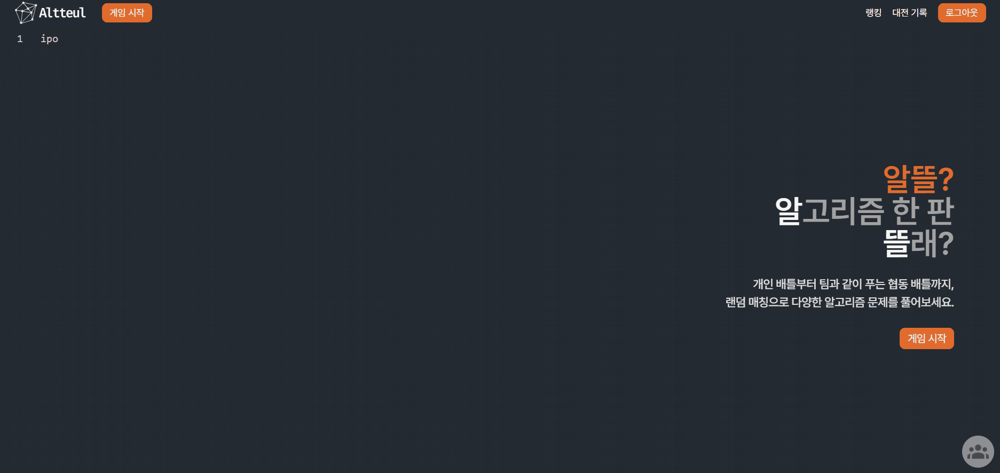
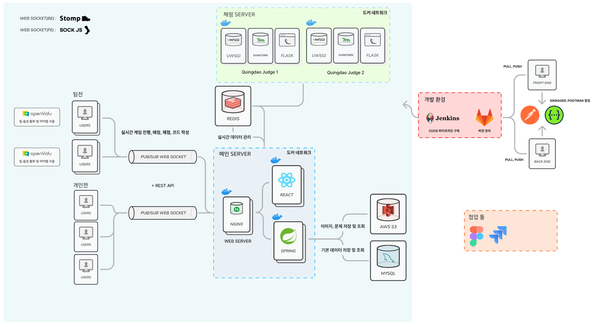

## 💡 프로젝트 소개

### ⚙ 개요

- 진행 기간 : 2025/1/13 ~ 2024/2/20
- 소개 : 알고리즘 배틀 사이트

### ⚙ 기획 배경

- 혼자 알고리즘 문제를 풀었을 때 느끼는 답답함을 누군가와 공유하고 싶다는 아이디어에서 착안
- 단순히 코드만 공유할 수 있는 협업 툴이 아니라 함께 문제를 풀고 경쟁하며 성장할 수 있는 서비스로 구체화 

### ⚙ 팀 구성

|         |       포지션       |                    역할                    |
|:-------:|:---------------:|:----------------------------------------:|
| **김덕진** |  Frontend, 팀장   |                                          |
| **박가희** | Frontend, FE 리더 |                                          |
| **장희현** |    Frontend     |                                          |
| **진우석** | Backend, BE 리더  |                                          |
| **김성찬** |     Backend     |                                          |
| **김시아** |     Backend     | 팀전/개인전 매칭, 랭킹 데이터 처리 및 페이지 조회/검색 , S3 연동 |

 

### ⚙ 개발 환경 및 기술

### ⚙ API 명세서

http://localhost:8080/swagger-ui/index.html#/

### ⚙ ERD

https://www.erdcloud.com/d/4NDsDbCnsSfs4cGsh

### ⚙ 아키텍처

 

## 🆚 서비스 소개

### ⚙ 회원가입

|                                                   |                                                   |
|---------------------------------------------------|---------------------------------------------------|
|                |  |
| 일반 회원가입                                           | 깃허브 회원가입                                          |

### ⚙ 로그인

### ⚙ 마이페이지

### ⚙ 친구 신청

### ⚙ 채팅

### ⚙ 랭킹 페이지

### ⚙ 개인전 매칭

### ⚙ 개인전 배틀

### ⚙ 팀전 매칭

### ⚙ 팀전 게임 초대

### ⚙ 팀전 배틀

